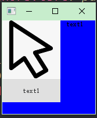

## Qt 关键点

### 关于问题:

1.资料库

```
https://mirrors.tuna.tsinghua.edu.cn/qt/online/qtsdkrepository/windows_x86/desktop/tools_mingw/
https://mirrors.tuna.tsinghua.edu.cn/qt/online/qtsdkrepository/windows_x86/desktop/qt5_5142/
https://mirrors.tuna.tsinghua.edu.cn/qt/online/qtsdkrepository/windows_x86/desktop/qt5_5142_src_doc_examples/
https://mirrors.tuna.tsinghua.edu.cn/qt/online/qtsdkrepository/windows_x86/desktop/qt5_5142_wasm/

```

```
源码在线查看
https://codebrowser.dev/qt5/
```

2.QtCreator打开巨慢很卡

```
可能是同时打开了多个版本的creator导致QtCreator.ini 很大。  删掉其中的乱码即可。
```

3. 打开项目 ， 项目页面 出现很多replacement for ...  打开mange kit  删掉 replacement 开头的即可

4. 编译项目时 出现 mingw32-make[1]: Nothing to be done for 'first'.  可能是 项目文件  

   ```
   SUBDIRS += testQtQuick \\
     			xxx \ 
     			换行符导致。
   
   ```

   

### 积累

```
官方例子 https://doc.qt.io/qt-5/all-examples.html
```


### 1.信号槽


```
基于元对象系统实现， 设计模式角度上 来看是一种观察者模式

https://blog.51cto.com/quantfabric/2070398

信号与槽可以传输结构体或者自定义类型
qRegisterMetaType<cv::Mat>("cv::Mat");  注册自定义类型

qml中注册类型
qmlRegisterType<Welcome::Manage>("Welcome", 1, 0, "WelcomeManage");
```

### 2.样式表

```
1.语法：
	选择器  {属性1 ： 值1 ; 属性2 ： 值2 ...}
	eg:  QPushButton, QLineEdit, QComboBox { color: red }
2.QPushButton#okButton 指定类名为okButton的样式表

3.Pseudo-States ： 伪状态
	QPushButton:hover { color: white }
	QRadioButton:!hover { color: red }
4.子控件  比如这里设置combox下拉框的图片
  QComboBox::drop-down { image: url(dropdown.png) }
```

### 3.并发编程

```
1.qt 线程池使用
class HelloWorldTask : public QRunnable
  {
      void run() override
      {
          qDebug() << "Hello world from thread" << QThread::currentThread();
      }
  };

  HelloWorldTask *hello = new HelloWorldTask();
  // QThreadPool takes ownership and deletes 'hello' automatically
  QThreadPool::globalInstance()->start(hello);
  
  QFuture<void> QtConcurrent::map(Sequence &sequence, MapFunctor function) 可以处理大量数据
```

### 4.Model/View

​	

模型视图结构 是 界面组件与数据关联的结构

### 5. 零碎知识

属性宏 Q_PROPERTY()

eg:

类里面声明宏，对text属性进行修饰

  Q_PROPERTY(QString text READ getText WRITE setText)

  QString text;         


## Qt quick

---

### QML

####  简单示例

```
import QtQuick 2.9      //导入类型
import QtQuick.Window 2.2
import QtQuick.Controls 2.2

//窗体
Window{
    visible: true   //可显示
    Rectangle{	    //矩形区域
        width: 400
        height: 400
        color: "blue"		
    }

    Image {  //图像
        id: name    //id 其它控件可引用这个id
        source: "res/鼠标.png"
        width: 100
        height: 100
        anchors.left: parent      //相对于父控件区域内的位置
    }

    Text {		//文本
        x:110
        y:0
        width: 100
        height: 90
        id: text1
        text: qsTr("text1")
    }

    Button{	//按钮
        x:0
        y:100
        text: text1.text   //这里引用了id为text1的控件的文本
    }
}

```

结果如下



#### 语法

**注意：**

```
Rectangle
需要放到Window下才显示
```

打印日志:  			console.log


​	

---

