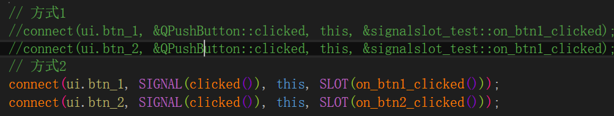
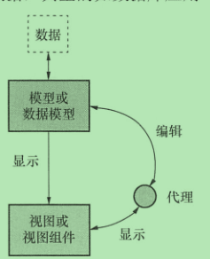

### Qt 关键点

关于问题:
1.资料库

```
https://mirrors.tuna.tsinghua.edu.cn/qt/online/qtsdkrepository/windows_x86/desktop/tools_mingw/
https://mirrors.tuna.tsinghua.edu.cn/qt/online/qtsdkrepository/windows_x86/desktop/qt5_5142/
https://mirrors.tuna.tsinghua.edu.cn/qt/online/qtsdkrepository/windows_x86/desktop/qt5_5142_src_doc_examples/
https://mirrors.tuna.tsinghua.edu.cn/qt/online/qtsdkrepository/windows_x86/desktop/qt5_5142_wasm/

```

```
源码在线查看
https://codebrowser.dev/qt5/
```

2.QtCreator打开巨慢很卡

```
可能是同时打开了多个版本的creator导致QtCreator.ini 很大。  删掉其中的乱码即可。
```


#### 1.信号槽



```
基于元对象系统实现， 设计模式角度上 来看是一种观察者模式

https://blog.51cto.com/quantfabric/2070398
```

#### 2.样式表

```
1.语法：
	选择器  {属性1 ： 值1 ; 属性2 ： 值2 ...}
	eg:  QPushButton, QLineEdit, QComboBox { color: red }
2.QPushButton#okButton 指定类名为okButton的样式表

3.Pseudo-States ： 伪状态
	QPushButton:hover { color: white }
	QRadioButton:!hover { color: red }
4.子控件  比如这里设置combox下拉框的图片
  QComboBox::drop-down { image: url(dropdown.png) }
```

#### 3.并发编程

```
1.qt 线程池使用
class HelloWorldTask : public QRunnable
  {
      void run() override
      {
          qDebug() << "Hello world from thread" << QThread::currentThread();
      }
  };

  HelloWorldTask *hello = new HelloWorldTask();
  // QThreadPool takes ownership and deletes 'hello' automatically
  QThreadPool::globalInstance()->start(hello);
  
  QFuture<void> QtConcurrent::map(Sequence &sequence, MapFunctor function) 可以处理大量数据
```

#### 4.Model/View 

​	

模型视图结构 是 界面组件与数据关联的结构